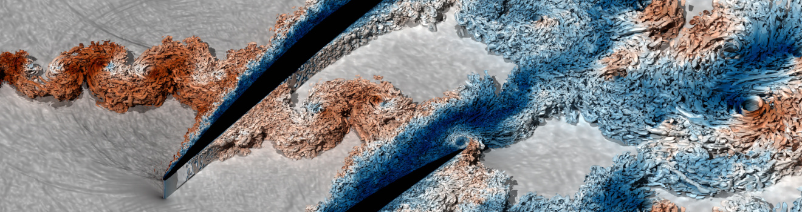

### Hey there 👋

🔭 &nbsp; My motivation has always been the combination of scientific curiosity and the challenges of cutting-edge technology.

⭐ &nbsp; I thrive on the synergy between science and number crunching. This could mean optimizing algorithms for novel HPC systems, implementing cutting-edge numerical methods, or finding new ways to push the boundaries of numerics beyond traditional simulations.

📝 &nbsp; I have contributed to a number of open-source projects both inside and outside of CFD along the road.

🖥️ &nbsp; Currently, I am working on improving high-order accurate Discontinuous Galerkin Spectral Element Method (DGSEM) solvers for High-Performance Computing (HPC) and GPU acceleration.

💬 &nbsp; If you're into CFD, HPC, or Python, C, C++, Fortran, feel free to reach out!

