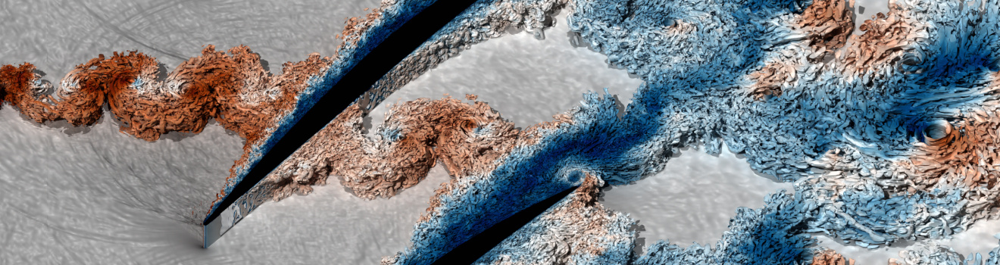

<h3 align="center">👋 Hey there, I'm Patrick Kopper</h3>

  <a href="https://linkedin.com/in/kopperp">LinkedIn</a> •
  <a href="https://orcid.org/0000-0002-7613-0739">ORCID</a> •
  <a href="https://www.iag.uni-stuttgart.de/en/institute/team/Kopper-00001">Institute</a>

I am a Postdoctoral Research Scientist at University of Stuttgart, Germany. Currently, I am working on improving high-order accurate Discontinuous Galerkin Spectral Element Method (DGSEM) solvers for High-Performance Computing (HPC) and GPU acceleration.

### What do I do and What have I done?
- My motivation has always been the combination of scientific curiosity and the challenges of cutting-edge technology.
- I thrive on the synergy between science and number crunching. This could mean optimizing algorithms for novel HPC systems, implementing cutting-edge numerical methods, or finding new ways to push the boundaries of numerics beyond traditional simulations.
- I have contributed to a number of open-source projects both inside and outside of CFD along the road. My goal is to make my work accessible to everyone.

If you're into CFD, HPC, or Python, C, C++, Fortran, feel free to reach out!

